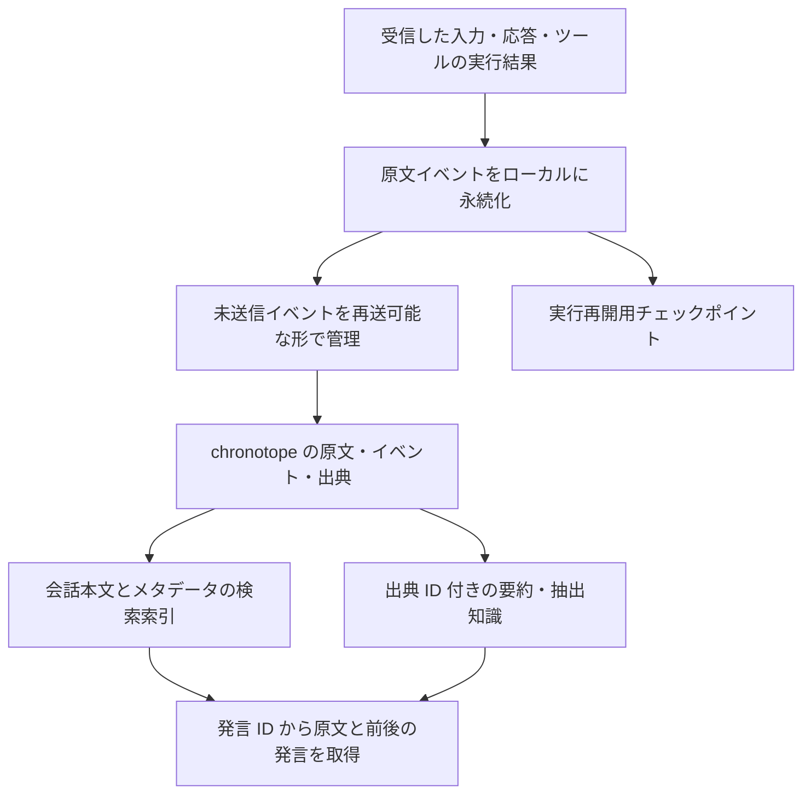

# chronotope による会話・ツール履歴の管理

状態: ano 側の保存・再送・参照ツール連携まで実装済み。実 chronotope サーバー（`38b3129`）を使う
結合試験 `tests/history_workflow.rs` は 2026-09-27 に成功を確認した（下記の実行方法を参照）。

2026-09-27 に ano の作業ツリーと、chronotope の main
（`38b3129257be40eb3cff1a34c50579c94d62a939`）のソースを確認した。
前回確認した `214c44c` から、原文のページ取得、会話本文の検索、非公開の原文への閲覧制御、
イベントの冪等な登録、生成元の区別が追加された。以下は新しい API に合わせた導入設計である。

## 結論

chronotope は、原文・取得時刻・出典内の位置・変更履歴を保持する基盤として利用できる。
前回不足していた保存・検索・取得の主要な機能は実装されており、ano から接続する実装を追加した。
ただし「保存できること」と「ユーザーとのやり取りを正確に参照できること」は別の要件である。
受信した原文を追記保存し、検索結果から発言 ID を使って原文と前後の文脈を取得する経路が必要になる。
要約や抽出した知識は、必ずその原文を参照する派生データとして扱う。

## 使い始める

chronotope の HTTP サーバーを起動し、`config.toml` で `[history] enabled = true` を設定する。
`data_dir` は ano が先に書き込む未送信キューなので、プロセスや chronotope の再起動後も削除しない。

```sh
chronotope serve --data .ano/chronotope --addr 127.0.0.1:7878
ano run --environment default "前回の依頼を確認して"
ano history status
ano history sync
```

`token_env` を設定する場合は、指定した環境変数に HTTP Bearer token を入れる。公開環境では、
`x-chronotope-on-behalf-of` を認証済みの委任情報からだけ設定できるゲートウェイを前段に置く。

## 現状と不足

| 対象 | 確認した実装 | 導入に必要な対応 |
|---|---|---|
| ano の保存 | `ConversationStore` を `RecordedConversation` でラップし、入力・応答・ツール呼び出し・結果・圧縮・中断をローカルへ先に追記する | この順序と、中断したツールを自動再実行しない性質を維持する |
| ano のチャット | `--session` がない場合も会話 ID と原文イベントを保存する。ファイル保存時の圧縮では元履歴を別ファイルへ退避する | 圧縮されるモデル用履歴とは独立した、永続的な原文履歴を持つ |
| 発言者の識別 | 自動継続指示や失敗通知も API 上の `role: user` として保存される | API の role と、実際の発言者・生成元を別々に記録する |
| 入力の原文 | CLI / チャット / Webhook はモデル用入力と変換前の入力を分けて渡す | インターフェースが受け付けた入力を、整形・変換する前に記録する |
| chronotope の原文保存 | `record_event` / `record_events` が発言 ID・順序・生成元と原文を記録する | ano の各入力・実行境界から呼び出す |
| 原文の読み出し | `history_get` と `get_acquisition` は UTF-8 の文字境界を保つページ取得に対応する | `next_offset` をたどり、必要な引用範囲や全文を取得する |
| 本文検索 | `history_search` が会話本文を索引し、会話・生成元・種別・期間で絞り込める。`exact: true` は原文の連続一致 | ano の履歴参照ツールから利用する |
| 再送 | イベント ID と内容が同じならイベントも Revision も増えない。内容や記録順の衝突はエラー | ano で送信前に ID・順序を永続化し、再送時も同じ値を使う |
| 非公開の会話 | 会話イベントの Source は既定で所有者のみ閲覧可能。Acquisition の直接取得にも可視性を適用 | 認証済みのユーザーと委任情報を接続設定へ渡す |

chronotope の現在の永続化は JSONL の Revision ログと Object Storage であり、
PostgreSQL / Citus を稼働中の読み書きバックエンドとして使う実装ではない。
既定の `KbConfig` は `fsync: true` に変更された。スナップショットを保存してからログを追記し、
起動時にはログ末尾の書きかけを処理する。再起動と未完のログ末尾からの回復は既存テストで確認した。
実際の電源断やストレージ障害の試験まで実施したわけではない。

## 推奨する構成



初期導入では、実行再開用チェックポイントに既存の `ConversationStore` を使い、
原文の追記ログと chronotope への同期を追加する。
ローカルに保存したイベント自体を未送信キューとして使い、送信済み位置を別に管理すれば、
DB に届く前の終了や、DB が保存した後に応答だけ失われた場合にも再送できる。
同期遅延と未送信件数は参照側にも示す。chronotope の本文索引はコミットと同時に更新されるが、
`index.consistent: true` は ano の未送信イベントまで存在しないことを示す値ではない。
`gaps` / `missing_sequences` は記録済みの範囲内の欠番を示すため、先頭や末尾の未送信分は
ano の送信済み位置とローカルの最終記録順を照合して確認する。

原文履歴の記録は、CLI のセッション指定の有無によらず、連携を有効にした実行に適用する。
Webhook や委任した実行も対象にする場合は、それぞれの入力境界と実行 ID から同じ経路へ記録する。
UI に表示する進捗イベントだけでは、受信原文や完全なツール結果の代替にならない。

## 原文イベントの契約（実装済み API への対応）

保存には `/v1/write` の `record_events` を使用する。以下は chronotope の実際の項目名である。

| 項目 | 用途 |
|---|---|
| `event_id` | 保存前に採番する変更しない ID。再送時の重複排除にも使う |
| `owner`, `conversation` | 所有者と会話の境界。`owner` はサーバが認証済み主体または委任元から確定する。書き込み本文では指定しない |
| `turn`, `sequence` | ターンと会話内の確定した記録順。時刻だけで順序を決めない |
| `kind`, `origin`, `api_role` | ユーザー発言、助手応答、ツール呼び出し、結果、内部指示などを区別する |
| `received_at`, `recorded_at` | 受信時刻と保存時刻。後から取り込んだ履歴で混同しない |
| `response_id`, `call_id`, `parent_event` | 応答、並行ツール実行、委任先の因果関係をつなぐ |
| `content` または `content_base64`, `content_hash` | 受信原文とその照合値。本文は一方だけ指定し、整形や Unicode 正規化で原文を上書きしない |
| `acquisition` | 保存結果で返る原文への参照。検索・取得結果の `range` / `match` は原文のバイト範囲を示す |
| `status`, `supersedes`, `derived_from` | `ok` / `error` / `interrupted` / `unknown`、訂正先、要約元を表す |

1 回の発言やツール結果を基本単位として保存する。HTTP の本文上限は既定で 64 MiB、
`record_events` は 1 回 1000 件までなので、ano は送信サイズと件数でバッチを区切る。
単独でも上限を超える添付・本文は、ano 側で内容ハッシュ付きの分割と復元形式を定義する。
分割したデータは元のバイト列へ復元できるようにし、引用範囲は復元した原文に対して指定する。
ユーザーによる訂正や編集は新しいイベントとして保存し、過去の記述を上書きしない。
検索用の正規化や埋め込みは原文から再生成できるようにする。

実際のユーザー入力は `origin: human`、自動継続指示は `origin: runtime` などとする。
この値をモデルに推測させず、入力・生成を受け持つコードが設定する。
ツールの記録では呼び出しと結果を `call_id` で結び、中断を成功と扱わない。

## 正確に参照するためのツール

以下の操作は chronotope の `/v1/query` に実装済みである。
ano 側に同名の参照ツールを公開するアダプターを追加し、各リクエストに `budget_ms` を指定する。

- `history_search`: 本文・時期・発言種別・会話を指定して候補を探す。
  発言 ID、発言者、日時、抜粋、索引の状態、結果の打ち切りと続きの有無を返す。
- `history_get`: 発言 ID から原文を取得する。大きな本文はバイト位置を指定して最後まで読める。
  返した範囲、全体の長さ、内容ハッシュを返す。
- `history_context`: 発言の前後を記録順で取得する。
  ユーザーの条件変更、応答、ツールの呼び出しと結果をまとめて確認できる。
- `history_conversations`: 会話ごとの件数・記録順・欠番を取得する。
  ローカルの未送信キューと合わせて同期状態を調べる。

`history_get` の続きは `next_offset` を次の `offset` に渡して取得する。
既定のページは 64 KiB、指定できるページサイズの上限は 1 MiB。
`history_context` の本文は抜粋であるため、その `next_offset` がある場合は `history_get` で続きを読む。
ユーザー本人の発言を探すときは `origins: ["human"]` を指定し、必要に応じて前後の応答も確認する。

所有者の制約はツール実装が認証済みのコンテキストから設定し、モデルの引数では緩められないようにする。
原文が読めなかったときや検索が途中で打ち切られたときは、その状態を明示する。
「検索で出なかった」を「その発言が存在しなかった」と扱わない。

「以前何を依頼したか」に回答する際は、検索候補から原文と必要な前後関係を読み、
確認した発言 ID・日時・引用範囲を根拠にする。要約だけを根拠に逐語引用しない。
完全一致が必要な検索は索引で候補を絞った後、原文の文字列で検証する。
これにより引用内容と出典の一致は機械的に検証できるが、曖昧な質問の検索漏れやモデルの解釈まで
データベースだけで完全に防げるわけではない。

## ano 側の実装

1. `[history]` で接続先・主体・委任元・タイムアウト・ローカル履歴の保存場所を設定する。
   `ano` は HTTP クライアントから保存と参照を行い、モデルの引数で所有者を変更できない。
2. CLI / チャット / Webhook の受信境界で原文をローカルへ保存する。モデルへの入力を組み立てる前に
   会話 ID・記録順・受信時刻を確定し、人の入力と内部生成文を分ける。`/goal` などの元の指示も残す。
3. モデル応答・ツールの引数と完全な結果・圧縮・中断を記録する。`ConversationStore` をラップして
   ネットワークに依存せず先に永続化し、実行終了時に同期する。到達できない接続先で待たないよう、
   接続は最大 2 秒で打ち切る。履歴の記録はモデルへの入力や API の使い方を変えない。
   `--session` のない実行では記録専用のストアを使い、`previous_response_id` による継続も従来どおり行う。
4. ローカルの未送信イベントを、会話ごとに 100 件または 4 MiB ずつ記録順に再送する。全イベントの
   ID・順序・取得 ID を確認できた場合だけ、会話ディレクトリの `sent` に送信済みの最後の記録順を書く。
   応答消失後も同じイベントを再送でき、未送信分の確認は送信済み位置の次から調べるだけで済む。
   chronotope が 4xx で拒否した場合は 1 件ずつ送り直して原因のイベントを特定し、その会話の送信を止める。
   他の会話の送信は続ける。接続できない場合は、待ち時間を重ねないよう同期全体を中断する。
   履歴ツールは未送信分があるときだけ先に同期し、送れなかった分は `local_sync` に警告と理由を返す。
5. `history_search` / `history_get` / `history_context` / `history_conversations` を登録し、回答時に
   原文と前後関係を読む。所有者と操作はクライアント側で固定し、検索結果が不完全なら警告を返す。

実行環境に `allowed_tools` を設定している場合は、履歴をモデルから参照できるよう
`history_*`（または個別の `history_search` など）も許可リストへ追加する。履歴保存自体は、
履歴参照 tool を許可しなくても動作する。

chronotope は HTTP ヘッダーから主体を作り、認証は前段のゲートウェイに任せる構成のままである。
`x-chronotope-on-behalf-of` は認証済みの委任だけを前段から渡す。
所有者・委任先による読み取りは API に実装済みなので、会話へ再配布可能なライセンスを付けたり、
エージェントを人間の管理者として扱ったりする必要はない。

## 移行と受け入れ条件

既存のセッション JSON と圧縮前アーカイブから、残っている原文は取り込める。
ただし、元の入力時刻・整形前の空白・内部生成文との区別が保存されていない場合は、
不明として扱う。復元できないメタデータを推測で埋めない。
メモリ内だけで終了した過去の会話は、この移行では回復できない。

2026-09-27 に以下を実行し、chronotope のワークスペース全体で **90 テスト成功・0 失敗**を確認した。
ビルド先は一時ディレクトリで、chronotope のソースは変更していない。

```sh
cargo test --workspace --locked --offline --target-dir /private/tmp/ano-chronotope-review-target
```

追加された履歴・非公開 Source 関連の 9 テストには、原文の一致、大きな本文のページ取得、
再送、生成元、ツールの対応付け、本文検索、所有者と委任先、鍵の破棄、再起動とログ末尾の回復、欠番を確認するケースが含まれる。
HTTP 前段の認証は、このテスト実行の対象外である。

ano と実 chronotope の結合試験は、ビルドした `chronotope` を指定して実行する。

```sh
ANO_CHRONOTOPE_BIN=/path/to/chronotope cargo test --test history_workflow -- --ignored
```

ano への連携実装の完了は、少なくとも以下で確認する。

- 日本語・絵文字・改行・前後の空白を含む入力が保存前と取得後で一致する。
- 64 KiB を超える発言とツール結果を、ページ取得から完全に復元できる。
- 圧縮・プロセス再起動後も同じ発言 ID から同じ原文と前後関係を取得できる。
- 自動継続指示、失敗通知、委任用のプロンプトをユーザー本人の発言として返さない。
- 並行ツールの結果を正しい呼び出しへ結び、中断した実行を勝手に再実行しない。
- 同期失敗や応答消失後の再送で同じイベントが増えず、同文の別発言は両方残る。
- 別ユーザーの履歴を、検索・発言 ID・Acquisition ID のいずれからも取得できない。
- 索引の遅延、検索の打ち切り、原文の欠落を呼び出し元が判別できる。

## 確認したソース

- ano: `src/application/ports.rs`、`src/domain/session.rs`、
  `src/infrastructure/session_store.rs`、`src/infrastructure/memory_store.rs`、
  `src/interface/cli/chat.rs`、`src/application/agent/mod.rs`。
- chronotope:
  [イベントのモデル](https://github.com/Mokuichi147/chronotope/blob/38b3129257be40eb3cff1a34c50579c94d62a939/crates/chronotope-core/src/model/conversation.rs)、
  [原文の登録](https://github.com/Mokuichi147/chronotope/blob/38b3129257be40eb3cff1a34c50579c94d62a939/crates/chronotope-engine/src/write.rs#L1317)、
  [履歴の検索・取得](https://github.com/Mokuichi147/chronotope/blob/38b3129257be40eb3cff1a34c50579c94d62a939/crates/chronotope-engine/src/query/history.rs)、
  [本文索引](https://github.com/Mokuichi147/chronotope/blob/38b3129257be40eb3cff1a34c50579c94d62a939/crates/chronotope-engine/src/history.rs)、
  [所有者と委任](https://github.com/Mokuichi147/chronotope/blob/38b3129257be40eb3cff1a34c50579c94d62a939/crates/chronotope-core/src/model/security.rs)、
  [履歴のテスト](https://github.com/Mokuichi147/chronotope/blob/38b3129257be40eb3cff1a34c50579c94d62a939/crates/chronotope-engine/tests/scenarios.rs#L711)。
